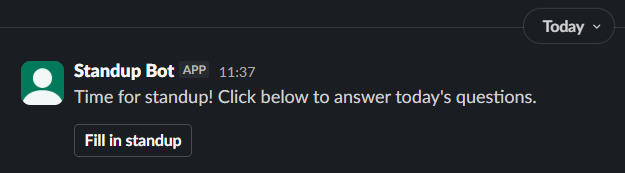
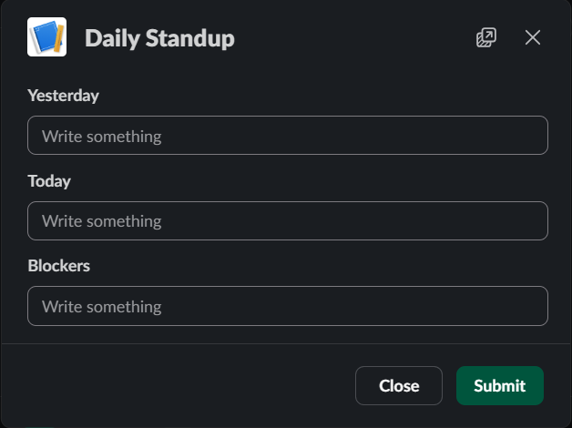
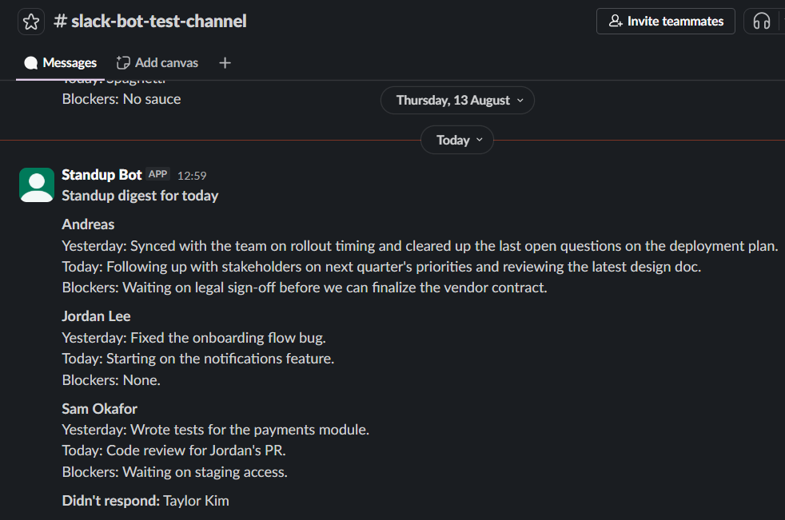
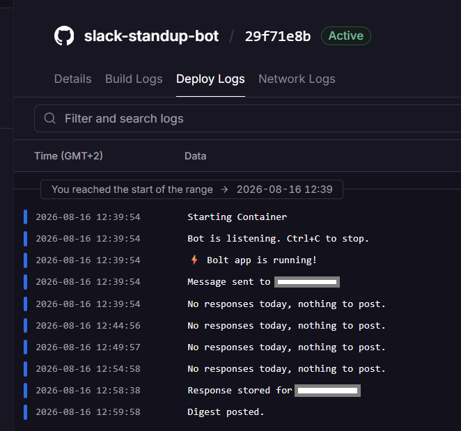

# Standup Bot

An async daily standup bot for Slack. DMs each team member three questions
every weekday morning, collects responses through the day, and posts a
digest to a team channel.

## What it does

- Each weekday morning, registered team members get DMed three questions –
  yesterday, today, blockers – at 9am in their own timezone.
- Responses are collected through the day via a Slack modal, with the latest
  submission winning if someone answers twice.
- At a set time, a digest is posted to a team channel, grouped by person,
  also listing anyone who hasn't responded yet.
- No digest is posted if nobody has responded.

## Screenshots

Each weekday morning, standup participants get prompted in Slack:



Clicking through opens a modal to answer the three questions:



Later, the digest is posted to the team channel:



*Jordan Lee, Sam Okafor, and non-responder Taylor Kim are seeded sample
data, added to illustrate a fuller team – only the first reply is real
usage.*

-------

Also verified running on a real cloud host, not just locally – deployed via
Docker to Railway, where it prompted, collected a response, and posted a
digest correctly:



## Tech stack

- Python
- Postgres (via Supabase)
- `slack_bolt` / `slack_sdk` (Socket Mode)
- `APScheduler` for timezone-aware scheduling
- Docker – containerized app, verified running on Railway
- GitHub Actions – builds and publishes the image to GitHub Container
  Registry (GHCR) on every push

## Architecture


Blue is the always-on loop: Slack and `bot.py` stay connected over Socket Mode
so Slack can push events in without `bot.py` needing a public address; an
`APScheduler` timer inside the same process wakes up every 5 minutes to check
whether it's 9am yet for any given member. Grey dashed is a different kind of
path – the admin scripts talk to Postgres directly, run once by hand when
setting up or registering someone, never while the bot is live.

## Status

Built and tested against a real Slack workspace, including real per-member
timezone-aware prompts and a scheduled digest. Also verified running
correctly on a cloud host (Railway, via Docker) – prompted, collected a
response, and posted a digest from there. Not kept running continuously
past that verification – see `DECISIONS.md` for the reasoning. Runs
locally, or via `docker run`, when actively started.

## Running your own instance

1. Create a Slack app with these bot scopes: `chat:write`, `im:write`,
   `users:read`. Enable **Socket Mode** (generates an app-level token) and
   **Interactivity**.
2. Create a Postgres database (e.g. via [Supabase](https://supabase.com)).
3. Copy `.env.example` to `.env` and fill in your own credentials.
4. Set up a virtual environment and install dependencies:
   ```
   python -m venv venv
   ./venv/Scripts/pip install -r requirements.txt
   ```
5. Set up the schema: `./venv/Scripts/python admin/create_tables.py`
6. Register a member: `./venv/Scripts/python admin/register_member.py <slack_user_id>`
7. Run the bot: `./venv/Scripts/python bot.py`

Alternatively, once `.env` is set up (step 3) and the schema exists
(step 5), skip the venv and run via Docker instead – this replaces
steps 4 and 7, same app, packaged and run as a container rather than
directly with your local Python:
```
docker build -t standup-bot .
docker run --env-file .env standup-bot
```

## How this was built

Built with Claude as a technical collaborator – I directed scope and
reviewed the design decisions, not a solo unaided build. This project was
mostly about learning. See `DECISIONS.md` for the trade-offs made along
the way.

This also isn't the first tool to solve this problem – Geekbot and Slack's
own Workflow Builder both already offer versions of async standups, and are
probably better alternatives. This was built deliberately as a learning
exercise, not because nothing like it exists.

## Technical concepts

- **Containerization** – packaging the app with Docker (Dockerfile, image
  layers, image vs. running container)
- **CI/CD pipelines** – GitHub Actions building and publishing a Docker
  image to a registry (GHCR) on every push
- **Cloud deployment** – verified running on a managed host (Railway)
- **OAuth & scoped permissions** – Slack app authentication via bot/app-level
  tokens, incrementally requesting new scopes as functionality grew
- **Real-time event handling** – Socket Mode for receiving Slack events
  without a public-facing server
- **Relational schema design** – normalized Postgres schema (separate
  members/responses tables), foreign keys, upsert logic via `ON CONFLICT`
- **SQL injection prevention** – parameterized queries throughout
- **Timezone-aware scheduling** – IANA region names rather than fixed
  offsets, per-member local-time prompts
- **Scheduling architecture** – in-process scheduler (`APScheduler`)

## Decisions log

See [DECISIONS.md](DECISIONS.md) for the running log of trade-offs made
throughout the project.
